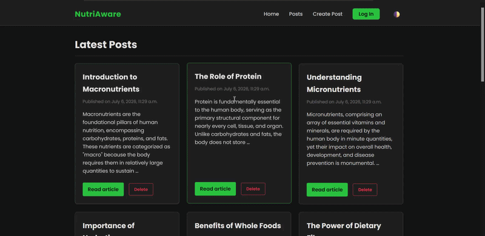

# 🍏 NutriAware

NutriAware is a modern, responsive web application built with Django. It serves as a dedicated platform for publishing, reading, and managing articles focused on nutritional science, holistic health, and dietary wellness. 

## 🚀 Demonstration

---

## ✨ Key Features

* **Dynamic Theme Toggling:** Seamlessly switch between a sleek charcoal Dark Mode and a clean Light Mode. User preferences are saved locally so the theme persists across sessions.
* **Responsive CSS Grid:** Articles are displayed in a modern card-based grid layout that automatically adapts to desktop, tablet, and mobile screens.
* **Full CRUD Functionality:** * Read detailed articles dynamically generated from the database.
    * Create new posts through a secure, styled form.
    * Delete posts securely via POST requests (with JavaScript confirmation prompts to prevent accidental deletions).
* **Modern UI/UX:** Built with raw CSS variables, flexbox, and the Poppins font family for a lightweight, fast, and beautiful user interface without relying on heavy external CSS frameworks.

---

## 🛠️ Tech Stack

* **Backend:** Python 3, Django 6.x
* **Frontend:** HTML5, Native CSS3 (CSS Variables, Flexbox, Grid), Vanilla JavaScript
* **Database:** SQLite (Default Django setup)

---

